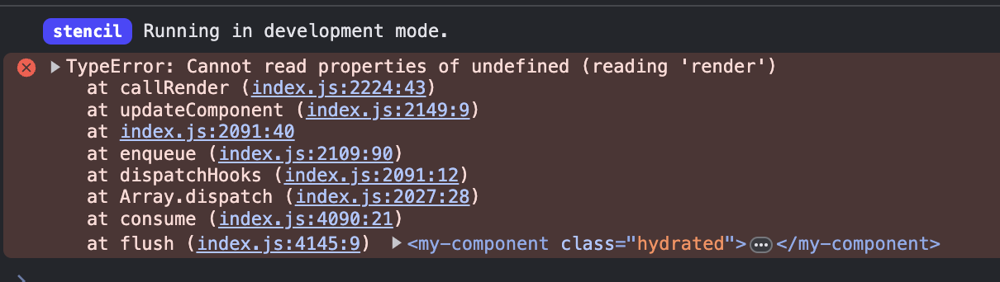
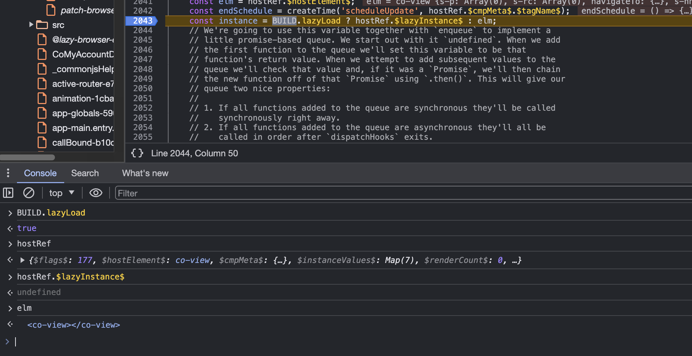

# Stencil instance not defined repro

## Setup my-component-lib

```terminal
cd my-componentlib
npm i
npm run build
npm link
```

## Setup consumer-app

```terminal
cd consumer-app
npm i
npm link my-componentlib
npm start
```

> Now open your browser and check the console

## Error

We get this error:



An analysis has shown that it could have to do with `BUILD.lazyLoad` could be involved:



Related Discord thread:
https://discord.com/channels/520266681499779082/1222283897124028496/1222283897124028496
